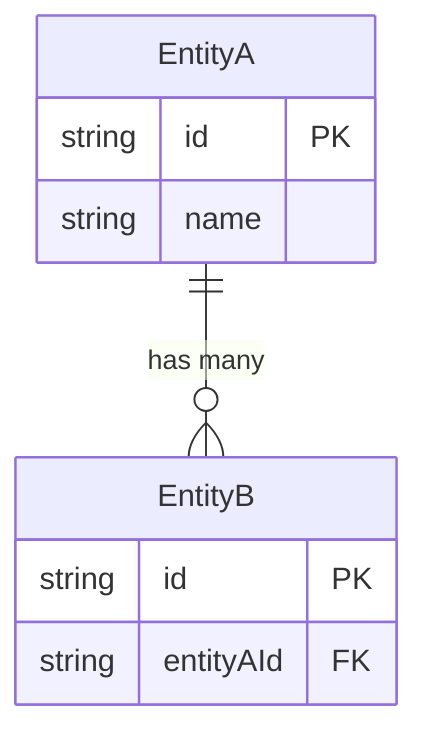

---
id: SPEC-009
title: "Sprint 3.5 — Wave 4B storage-core/entity-storage/query-dsl + pg-client adapter (3 packages + additive adapter per ADR-005)"
status: Draft
author:
created: 2026-05-06
updated: 2026-05-06
prd: PRD-009
type: API / Data Model / Protocol / UI Spec
depth: standard / deep / critical
---

# SPEC-009: Sprint 3.5 — Wave 4B storage-core/entity-storage/query-dsl + pg-client adapter (3 packages + additive adapter per ADR-005)

## Summary

Что специфицируется. Одно предложение.

## Scope

Какие контракты и модели описывает эта спецификация.

## API Contracts

### Endpoint: `{METHOD} /v1/{resource}`

**Description**: ...

**Request**:
```json
{
  "field1": "string (required)",
  "field2": 123
}
```

**Response** (`200 OK`):
```json
{
  "id": "uuid",
  "field1": "string",
  "createdAt": "2026-01-01T00:00:00Z"
}
```

**Errors**:
| Status | Code | Description |
|--------|------|-------------|
| 400 | INVALID_INPUT | ... |
| 404 | NOT_FOUND | ... |
| 409 | CONFLICT | ... |

### Endpoint: `{METHOD} /v1/{resource}/{id}`

...

## Data Models

### Entity: {EntityName}

```typescript
interface {EntityName} {
  id: string;           // UUID v7
  tenantId: string;     // Tenant isolation
  name: string;         // Display name
  status: Status;       // Draft | Active | Archived
  createdAt: Date;
  updatedAt: Date;
}

type Status = 'draft' | 'active' | 'archived';
```

**Constraints**:
- `name`: 1-255 chars, unique per tenant
- `id`: auto-generated, immutable

### Entity: {AnotherEntity}

...

## Relationships



## Validation Rules

| Field | Rule | Error |
|-------|------|-------|
| `name` | Required, 1-255 chars | `name is required` |
| `email` | Valid email format | `invalid email format` |

## Events / Side Effects

| Trigger | Event | Consumers |
|---------|-------|-----------|
| Create Entity | `entity.created` | Audit, Notifications |
| Update Status | `entity.status.changed` | Workflow |

## Versioning

| Version | Date | Changes |
|---------|------|---------|
| 1.0 | 2026-05-06 | Initial specification |

## Related

- PRD-009: {link}
- RFC-009: {link}
- ADR-009: {link}

---

> **Next step**: После approve -> создать RFC с архитектурой реализации.

